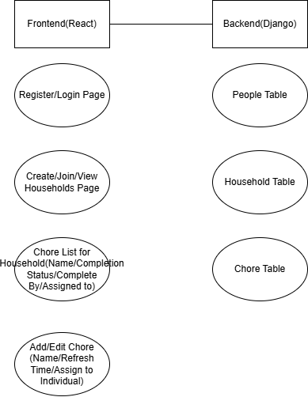
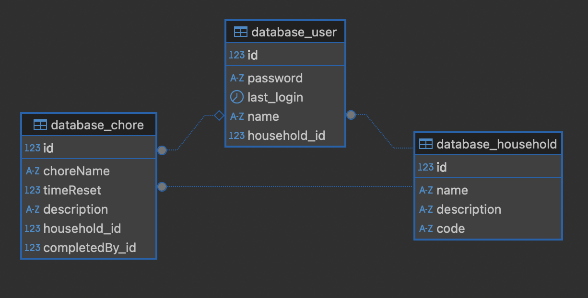

# ChoreMates Documentation

This document will be updated with dev notes

Architecture of Project:

## FrontEnd

The 

## BackEnd

The BackEnd is powered by RDS MySQL and Django. RDS Stores user/household/text data, Django handles the schema of the database and feeds/accepts data from FrontEnd.

Schema of Django BackEnd:

